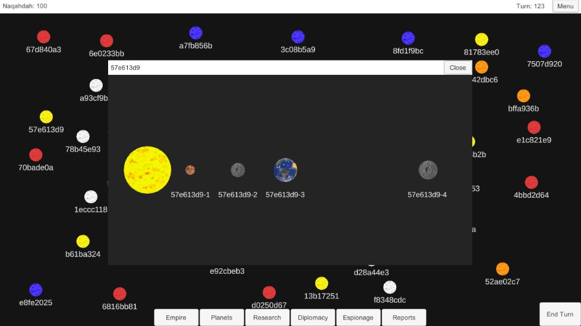

# ProjectCaprica-MyVersion

Following along with Quill18Create's Project Caprica tutorials (with some changes and tweaks).

Starts with video https://www.youtube.com/watch?v=s4XqPdaPUAg, and has eight segments (so far, but for at least the last year or so).

Above is the current state of my prototype, which visually is a step or two beyond the videos. Apart from the opening of the system view window however, and the generation of the stars and the systems, there is little else to this prototype. Fun to slap together though.

Also serves as a gentle, but more than basic, re-introduction to Unity for me after a while away.
